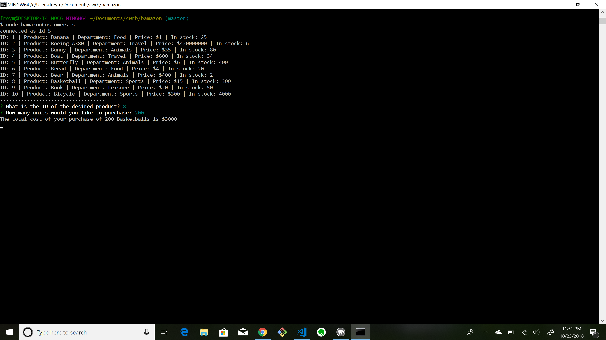
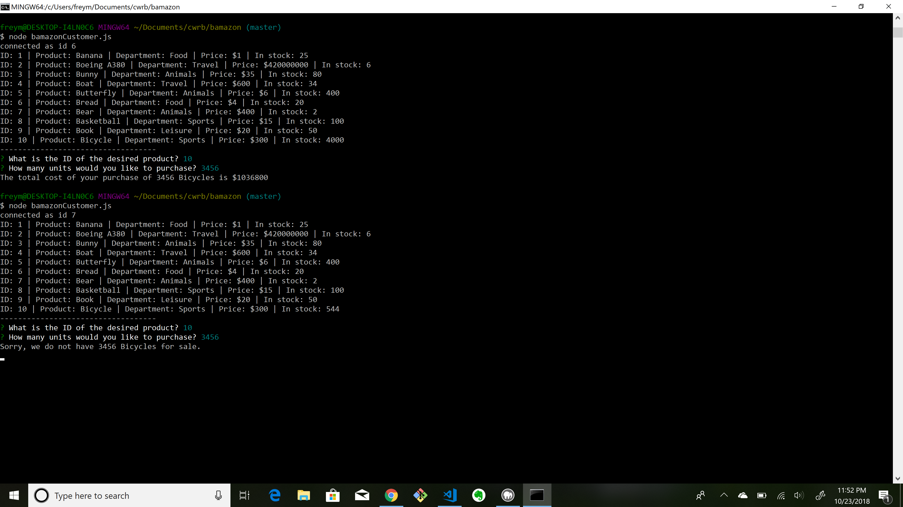
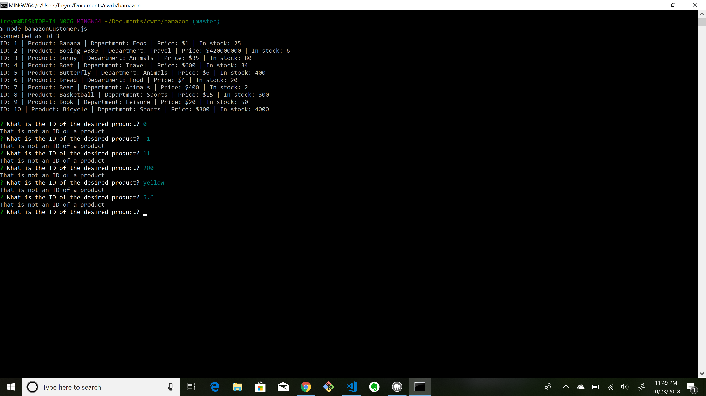
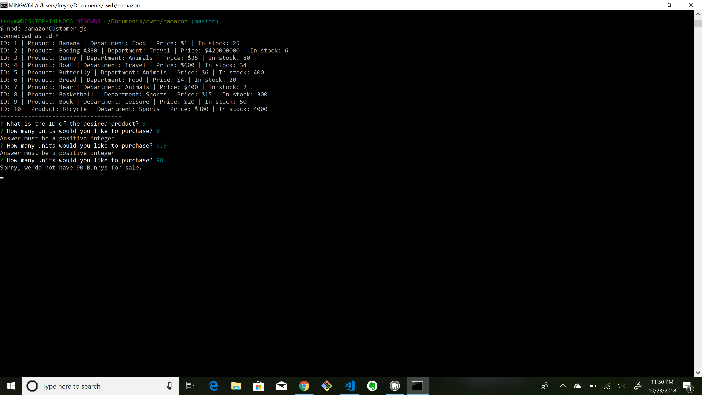

# bamazon
Amazon-like node app!

This is a command line application. 

It features heavily the use of 
MySql, npm, inquirer.

The main function is to use user input to get data from and write to a database. 

The main focus was having clean code and easy user interaction. 

This shows the table that is generated when the application is first run.

This shows the application successfully prompting, calculating, and showing the product desired, quantity bought, and total cost. 

This shows the application again successfully working, along with how it updates the quanity in the database after each purchace.
The user is unable to buy the same amount of product twice because there is not enough left. 

This shows the handling of some bad possible inputs. The input must be a positive integer no greater than the number of choices. 
We use recursion to let the user enter an acceptable value. 

Here we see the second bad input being handles similarly. Included at the end, the application alerts the user
if they try to buy more items than are in stock. 

